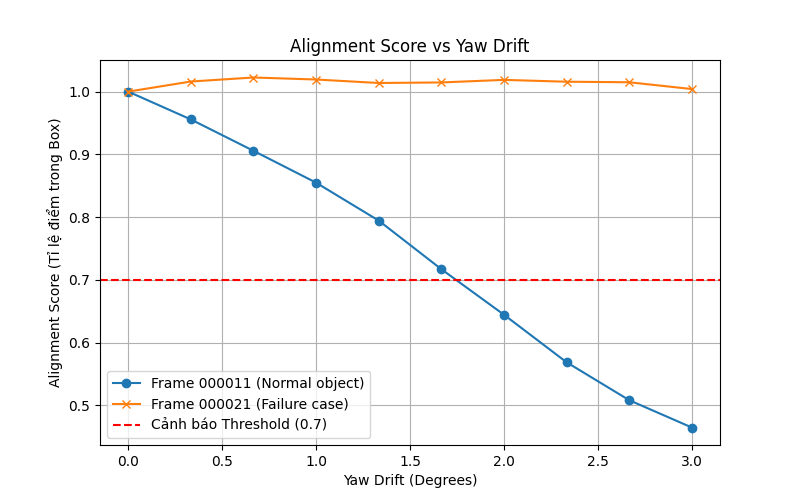
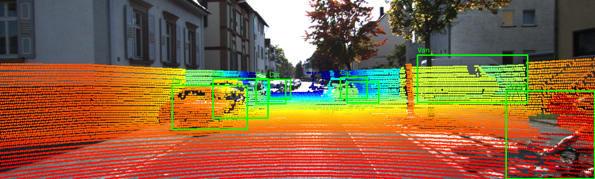

# Báo cáo Day 6: LiDAR-camera projection QA

> Thay **mọi** ô có chữ ĐIỀN nằm trong ngoặc vuông bằng nội dung của bạn, xoá luôn cả dấu ngoặc vuông. Lệnh `python tools/check_submission.py` sẽ báo FAIL nếu còn sót bất kỳ chỗ nào.

- **Họ tên:** Trần Xuân Tùng
- **MSSV:** 2A202602787 
- **Lớp:** H209

- **Link repo:** https://github.com/TranXuanTung/TranXuanTung-2A202602787-Track4-Day21
- **Topic:** A — LiDAR-camera projection QA
- **Dataset:** data/synthetic, data/kitti_mini, data/nuscenes_mini_subset
- **Các frame đã dùng:** 000000, 000011, scene-0103_010

> Hãy viết ngắn: mỗi mục từ 3 đến 8 dòng, ưu tiên số liệu và hình ảnh.

## 1. Claim

Lệch Yaw làm LiDAR trượt khỏi bounding box của camera. Bằng cách thiết kế Alignment Score (Tỷ lệ điểm LiDAR có độ sâu tương ứng nằm lọt trong Bounding Box 2D), ta có thể vẽ được đồ thị suy giảm của điểm số theo góc quay. Khi Score tụt xuống dưới ngưỡng 0.7 (giảm 30% số điểm), hệ thống sẽ phát hiện được Calibration Drift.

## 2. Evidence

Đồ thị cho thấy ở Frame 000011, khi Yaw tăng dần từ 0 đến 3 độ, Alignment Score giảm mạnh và cắt qua ngưỡng cảnh báo 0.7 ở mức lệch khoảng 1.5 độ.
Ngược lại, ở frame ngoại lệ (000021), score không bị giảm (đường màu cam).



## 3. Failure case

Nêu khi nào hệ thống hoặc phương pháp fail, vì sao fail, và liên hệ tới lớp nào trong 6 lớp debug: I/O, Geometry, Time, Preprocess, Model, Metric.



Lỗi ở lớp Metric. Alignment Score (tỷ lệ điểm trong box) bị đánh lừa ở frame `000021`. Lý do: Bối cảnh vật thể trong ảnh nằm trải ngang dài và phẳng (như rào chắn hoặc tường). Dù LiDAR bị xoay lệch đi 3 độ, các điểm chỉ trượt dọc trên mặt phẳng đó, chưa lọt ra ngoài Bounding Box khổng lồ. Do đó, điểm số không giảm tuyến tính và hệ thống bị đánh lừa.

## 4. Khuyến nghị nếu triển khai thật

Alignment Score dựa trên sự trùng khớp hình học này là một Metric nhẹ và tuyệt vời để chạy real-time trên xe ADAS nhằm cảnh báo Calibration Drift. Tuy nhiên, vì nó có "điểm mù" (failure case) khi gặp các bức tường dài song song hoặc chướng ngại vật thiếu chi tiết dọc, hệ thống cần tính trung bình score xuyên suốt nhiều frame (Temporal Tracking) thay vì chỉ đo trên 1 frame đơn lẻ.

## 5. Cách chạy lại

Các lệnh tái tạo lại toàn bộ kết quả từ repo sạch.

```bash
python -m src.eval_advanced
```

## 6. Khai báo sử dụng AI

Ghi rõ đã dùng công cụ AI nào, dùng vào việc gì, và bạn đã tự kiểm chứng kết quả đó bằng cách nào. Nếu không dùng AI, ghi "Không sử dụng". Xem quy định ở `RULES.md` mục 2.

| Công cụ | Dùng cho việc gì | Bạn đã kiểm chứng thế nào |
|---|---|---|
| DeepMind AI | Hướng dẫn, viết script đánh giá độ nhiễu và định dạng báo cáo | Chạy lại toàn bộ script, kiểm tra ảnh `results/figures/fail_yaw_3deg.png` xem điểm chiếu lệch có đúng với thông số hay không |
